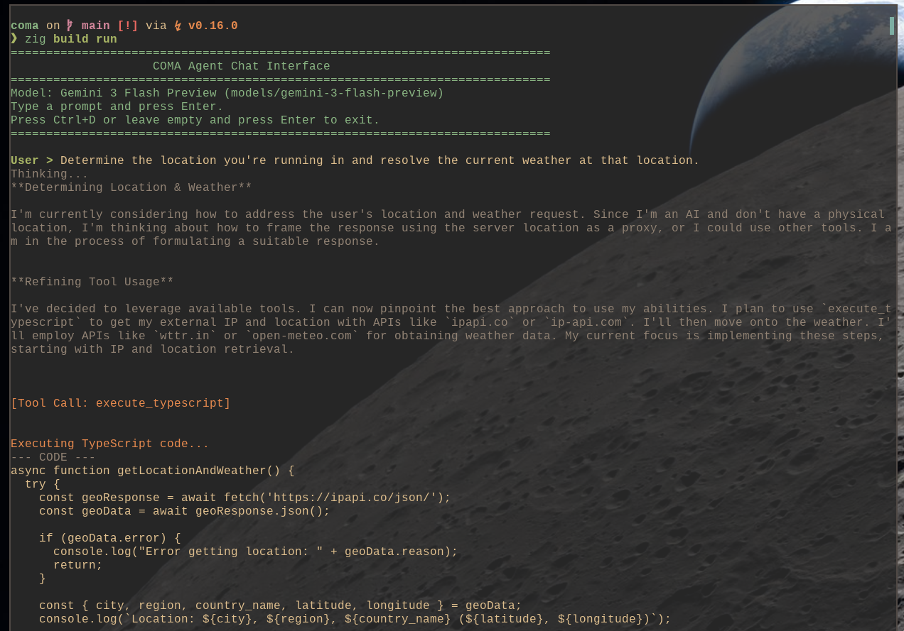

# COMA: Comptime Agent

An LLM agent architecture written entirely in native Zig.

It's entirely unnecessary that this is written in Zig rather than an easier to use/read language... but sometimes we just want to have fun.

